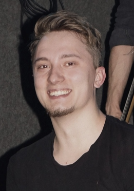
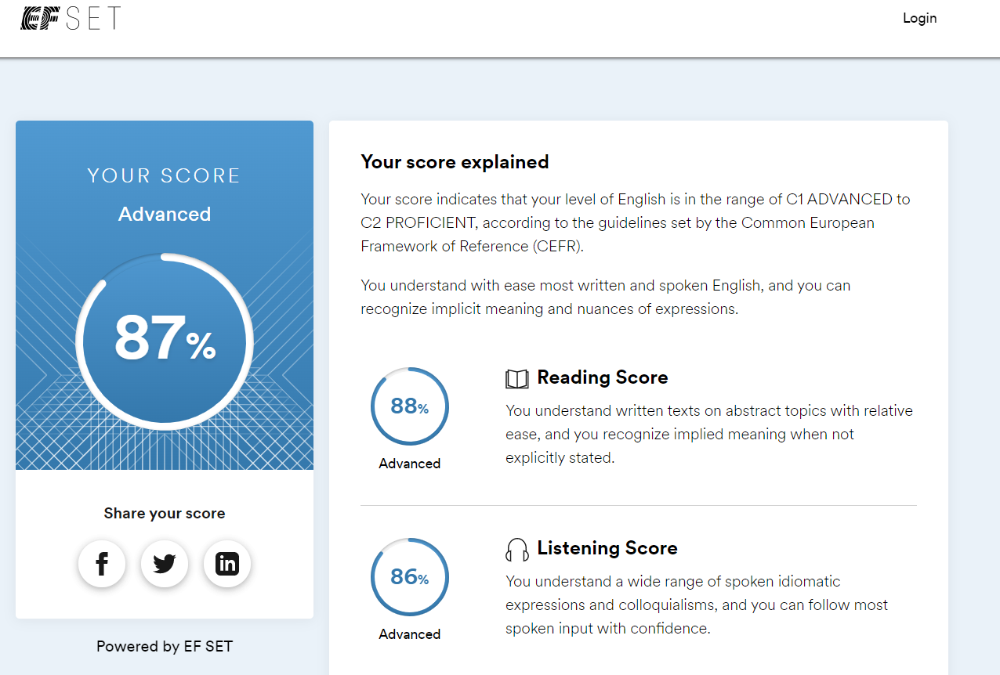

# Ilya Gudkov
##  **Junior front-end developer**

## Contact information: 
e-mail: *gudkov.id@mail.ru* 
tel: *+7 977 858 79 80*
discord: *altered.cat#3735* | *Ilya Gudkov (@gudkovsky)* - rs-school server
## Short info: 
### My goals
- Join a team in an interestion project in web-development;
- Grow as a professional, get an actual skills for success work;
- Build a network for my future;
- Find ways for self-realisation;
### My priorities:
- Self-developement and team-play;
### My strengths:
- Creative, self-motivative, self-educating, structured work, multi-tasking, always targeting a high-plank;
## My skills: 
- HTML5
I can write a good BEM markup;
- CSS3
I understand how to work with classes, forms, pseudo-elements, pseudo-classes, box-model, display types, flex and grid systems. I can use my knowledge and sense of perfection to add styles to a web-page. 
- Git
Basic knowledge.
- Photoshop
Basic knowledge.
- What do I use? 
VScode, GitBash, GitHub.
## Experience:
- Sedona. Web-page for a booking (*link will be added here*)
- Cat-Energy. Adaptive web-interface for an Internet shop (**in progress**) (*link will be added here*)
- Near-miss identification App, using power-apps from Microsoft
- ### Code-example:
```
function msg(){  
 alert("Hello RS");  
} 
```
## Non-IT Experience:
- ### A-Plus Developement. H&S specialist at large construction sites (IKEA, Toyota, AGC).
- ### PepsiCo: H&S specialist at production plant.
- ### Continental Tires: H&S and sustainability business-partner in back-office.
- #### 6 years+ overall
## Education:
- ### IT: 
**Front-end web-developement (HTML,CSS,JS)** at **HTML-Academy** - 2022;
**JS/FE junior** at **RS-School** - 2022.
- ### Non-IT: 
**Technosphere safety** at **MSAU** - 2012-2016.
## Language:
- Russian (native);
- English (intermediate). Speaking/writing as a work-routine at previous work.
