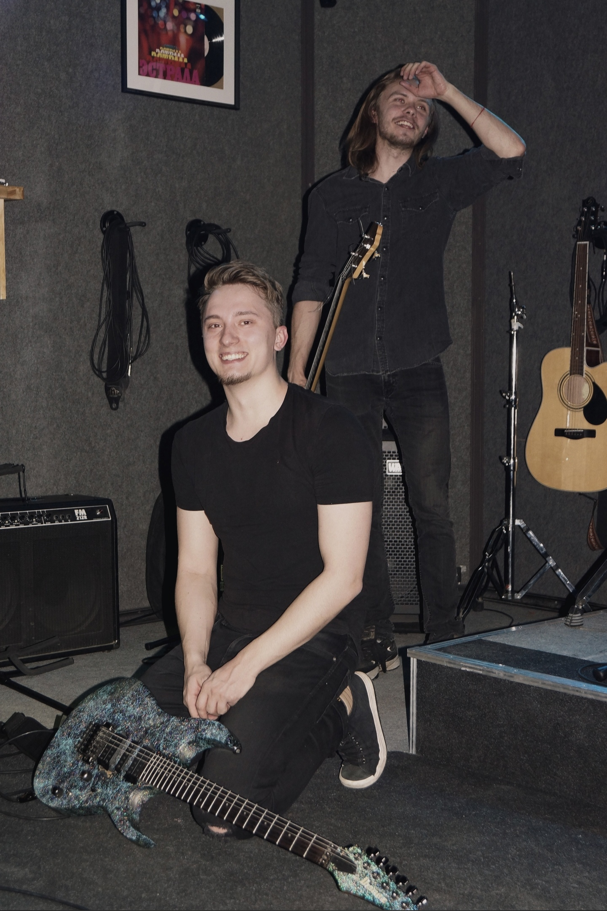

#  **Junior Web-developer CV**


1. ## Name: 
- *Ilya Gudkov*
2. ## Contact information: 
- e-mail: *gudkov.id@mail.ru* 
- tel: *+7 977 858 79 80*
- discord: *altered.cat#3735* | *Ilya Gudkov (@gudkovsky)* - rs-school server
3. ## Short info: 
### My goals
- Join a team in an interestion project in web-development;
- Grow as a professional, get an actual skills for success work;
- Build a network for my future;
- Find ways for self-realisation;
### My priorities:
- Self-developement and team-play;
### My strengths:
- Creative, self-motivative, self-educating, structured work, multi-tasking, always targeting a high-plank;
4. ## My skills: 
- HTML. I can write a good BEM markup;
- CSS. I understand how to work with classes, forms, pseudo-elements, pseudo-classes, box-model, display types, flex and grid systems. I can use my knowledge and sense of perfection to add styles to a web-page. 
- Git. Basic knowledge.
- What do I use? VScode, GitBash, GitHub.
5. ## Code examples:
- ***will be added soon***
6. ## Experience:
- Sedona. Web-page for a booking (*link will be added here*)
- Cat-Energy. Adaptive web-interface for an Internet shop (**in progress**) (*link will be added here*)
- Near-miss identification App (using power-apps from Microsoft | Zero coding)
- ### Code-example:
```
<div class="additional-menu">
    <a class="additional-menu-link black-icon"  href="#">
        <svg class="additional-menu-icon" aria-hidden="true" focusable="false" width="20" height="19" viewBox="0 0 20 19" xmlns="http://www.w3.org/2000/svg">
            <path d="M19.0257 17.05L15.3152 13.35C16.318 12.05 17.02 10.35 17.02 8.44995C17.02 4.04995 13.4098 0.449951 8.99732 0.449951C4.58483 0.449951 0.974609 4.14995 0.974609 8.54995C0.974609 12.95 4.58483 16.55 8.99732 16.55C10.8024 16.55 12.5072 15.95 13.9112 14.85L17.6217 18.55L19.0257 17.05ZM8.99732 14.55C5.68795 14.55 2.98029 11.85 2.98029 8.54995C2.98029 5.24995 5.68795 2.54995 8.99732 2.54995C12.3067 2.54995 15.0143 5.24995 15.0143 8.54995C15.0143 11.85 12.3067 14.55 8.99732 14.55Z"  />
        </svg>
```

7. ## Non-IT Experience:
- ### A-Plus Developement. H&S specialist at large construction sites (IKEA, Toyota, AGC).
- ### PepsiCo: H&S specialist at production plant.
- ### Continental Tires: H&S and sustainability business-partner in back-office.
- #### 6 years+ overall
8. ## Education:
- ### IT: 
*Front-end web-developement (HTML,CSS,JS)* at *HTML-Academy* - 2022;
*JS/FE junior* at *RS-School* - 2022.
- ### Non-IT: 
*Technosphere safety* at *MSAU* 2012-2016.
9. Language:
- Russian (native);
- English (intermediate). Speaking/writing as a work-routine at previous work.